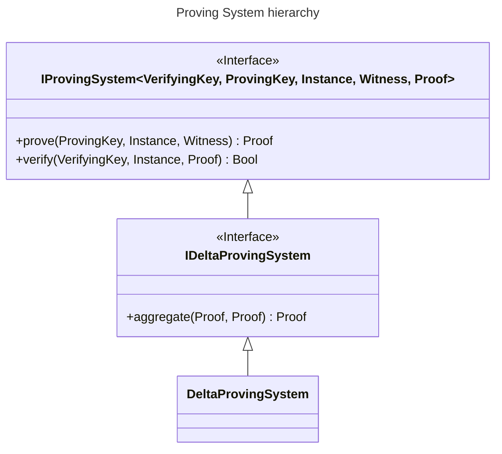

```juvix
module arch.system.state.resource_machine.primitive_interfaces.proving_system.proving_system_delta;
import prelude open;
import arch.system.state.resource_machine.primitive_interfaces.proving_system.proving_system_types as PS;
open PS using {ProvingSystemStructure};
open PS using {ProvingSystem};
```
<!--ᚦ how to open w/o running into issues with the record definition being in ambiguous placec?-->

# Delta Proving System

Delta proving system is used to prove that the transaction delta is equal to a certain value. To support transaction composition that results in a new transaction being produced, the delta proving system must, in addition to the standard proving system interface, provide a *proof aggregation function*:

`DeltaProvingSystem`:

1. `prove(PS.ProvingKey, PS.Instance, PS.Witness) -> PS.Proof`
2. `verify(PS.VerifyingKey, PS.Instance, PS.Proof) -> Bool`
3. `aggregate(PS.Proof, PS.Proof) -> PS.Proof`

The aggregation function allows to aggregate proofs in a way that if $\pi_1$ proves that the first transaction's balance is $b_1$ and the second proof $\pi_2$ proves the second transaction's balance is $b_2$, then the proof $Aggregate(\pi_1, \pi_2)$ proves that the composed transaction's balance is $b_1 + b_2$.

!!! todo "proper formalization of axioms (again)"

    ideally, we'd want to write the axioms in lean4, right?

```juvix
trait
type record DeltaProvingSystem (Statement Proof Instance Witness ProvingKey VerifyingKey : Type) := mkA@{
     provingSystem : ProvingSystem Statement Proof Instance Witness ProvingKey VerifyingKey; 
     };
```



