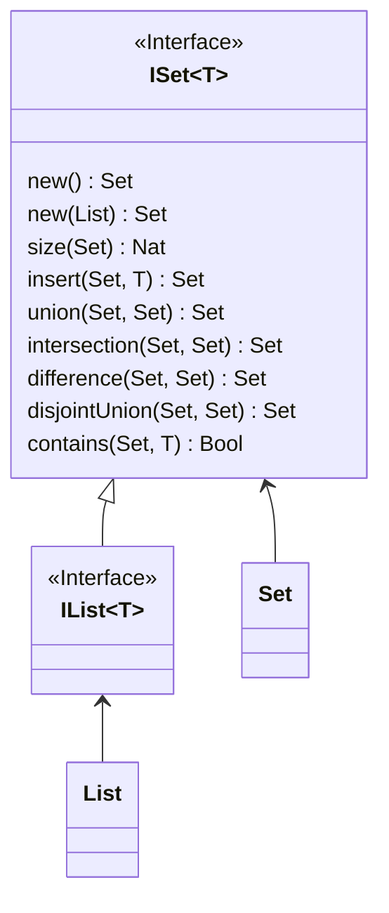

```juvix
module arch.system.state.resource_machine.primitive_interfaces.set;
```

# Set primitive interface

A set is an unordered data structure that contains only distinct elements.

## The interface

For a set parametrised over the element type `T`:

1. `new() -> Set` - creates an empty set.
2. `new(List) -> Set` - creates a set from the given list of elements. If the list contains duplicating elements, ignores them.
3. `size(Set) -> Nat` - returns the number of elements in the set.
4. `insert(Set, T) -> Set` - adds an element of type `T` to the set.
5. `union(Set, Set) -> Set` - computes the union of two sets.
6. `intersection(Set, Set) -> Set` - computes the intersection of two sets.
7. `difference(Set, Set) -> Set` - computes the difference of two sets. Note that this operation is not commutative.
8. `disjointUnion(Set, Set) -> Set` - computes the union of two sets. If the sets intersect, returns an error.
9. `contains(Set, T) -> Bool` - checks if an element is in the set.



## Used in
1. Transaction
