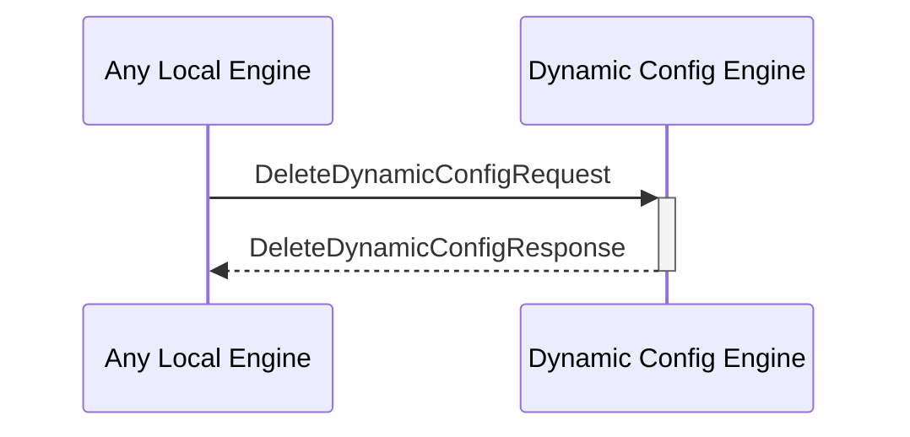

# DeleteDynamicConfigRequest

## Purpose

<!-- ANCHOR: purpose -->
Find a dynamic configuration by its key in the dynamic configuration KV-store and delete both the key and the value.
<!-- ANCHOR_END: purpose -->

## Type

<!-- ANCHOR: type -->
**Reception:**

[[DeleteDynamicConfigRequestV1#deletedynamicconfigrequestv1]]

{{#include ../types/delete-dynamic-config-request-v1.md:type}}

**Triggers**

[[DeleteDynamicConfigResponseV1#deletedynamicconfigresponseV1]]

{{#include ../types/delete-dynamic-config-response-v1.md:type}}

<!-- ANCHOR_END: type -->

## Behavior

<!-- ANCHOR: behavior -->
Performs the requested find operation in the dynamic configurations KV-store and delete both the key and the value.
<!-- ANCHOR_END: behavior -->

## Message Flow

<!-- ANCHOR: messages -->

<!-- ANCHOR_END: messages -->

