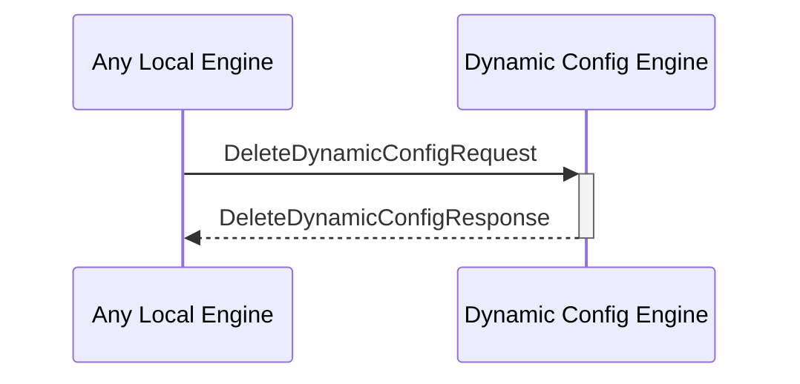

# DeleteDynamicConfigResponse

## Purpose

<!-- --8<-- [start:purpose] -->
Response to a [[DeleteDynamicConfigRequest#deletedynamicconfigrequest]].
<!-- --8<-- [end:purpose] -->

## Type

<!-- --8<-- [start:type] -->
**Reception:**

[[DeleteDynamicConfigResponseV1#deletedynamicconfigresponsev1]]

--8<-- "../types/delete-dynamic-config-response-v1.md:type"

**Triggers**

<!-- --8<-- [end:type] -->

## Behavior

<!-- --8<-- [start:behavior] -->
Performs the requested find operation in the dynamic configurations KV-store,
delete both the key and the value, and replies with the deleted key and value.
<!-- --8<-- [end:behavior] -->

## Message Flow

<!-- --8<-- [start:messages] -->

<!-- --8<-- [end:messages] -->

