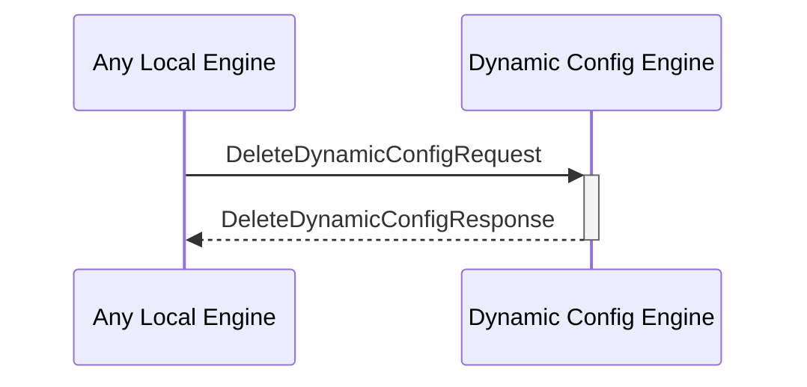

# DeleteDynamicConfigResponse

## Purpose

<!-- ANCHOR: purpose -->
Response to a [[DeleteDynamicConfigRequest#deletedynamicconfigrequest]].
<!-- ANCHOR_END: purpose -->

## Type

<!-- ANCHOR: type -->
**Reception:**

[[DeleteDynamicConfigResponseV1#deletedynamicconfigresponsev1]]

{{#include ../types/delete-dynamic-config-response-v1.md:type}}

**Triggers**

<!-- ANCHOR_END: type -->

## Behavior

<!-- ANCHOR: behavior -->
Performs the requested find operation in the dynamic configurations KV-store,
delete both the key and the value, and replies with the deleted key and value. 
<!-- ANCHOR_END: behavior -->

## Message Flow

<!-- ANCHOR: messages -->

<!-- ANCHOR_END: messages -->

