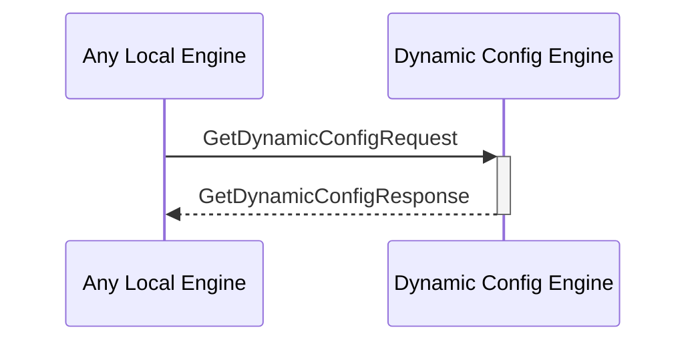

# GetDynamicConfigRequest

## Purpose

<!-- --8<-- [start:purpose] -->
Find a dynamic configuration by its key in the dynamic configuration KV-store and return the value.
<!-- --8<-- [end:purpose] -->

## Type

<!-- --8<-- [start:type] -->
**Reception:**

[[GetDynamicConfigRequestV1#getdynamicconfigrequestv1]]

--8<-- "../types/get-dynamic-config-request-v1.md:type"

**Triggers**

[[GetDynamicConfigResponseV1#getdynamicconfigresponsev1]]

--8<-- "../types/get-dynamic-config-response-v1.md:type"

<!-- --8<-- [end:type] -->

## Behavior

<!-- --8<-- [start:behavior] -->
Performs the requested search operation in the dynamic configurations KV-store and returns the value.
<!-- --8<-- [end:behavior] -->

## Message Flow

<!-- --8<-- [start:messages] -->

<!-- --8<-- [end:messages] -->

