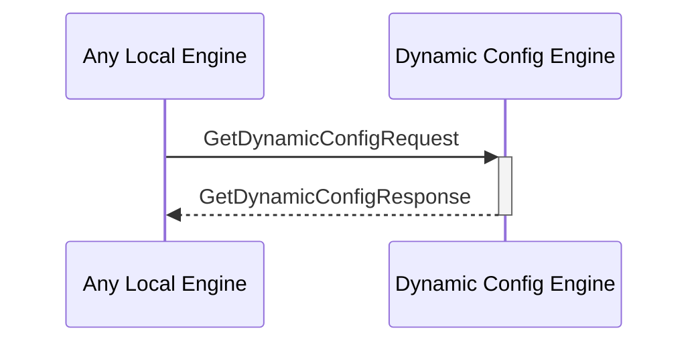

# GetDynamicConfigResponse

## Purpose

<!-- --8<-- [start:purpose] -->
Response to a [[GetDynamicConfigRequestV1#getdynamicconfigrequestv1]].
<!-- --8<-- [end:purpose] -->

## Type

<!-- --8<-- [start:type] -->
**Reception:**

[[GetDynamicConfigResponseV1#getdynamicconfigresponsev1]]

{{#include ../types/get-dynamic-config-response-v1.md:type}}

**Triggers**

<!-- --8<-- [end:type] -->

## Behavior

<!-- --8<-- [start:behavior] -->
Performs the requested search operation in the dynamic configurations KV-store and returns the value.
<!-- --8<-- [end:behavior] -->

## Message Flow

<!-- --8<-- [start:messages] -->

<!-- --8<-- [end:messages] -->

