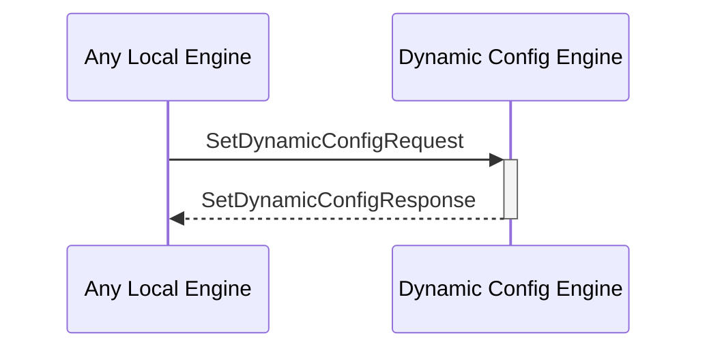

# SetDynamicConfigRequest

## Purpose

<!-- ANCHOR: purpose -->
Add a dynamic configuration by adding its key and the corresponding value to the dynamic configuration KV-store.
If the key already exists, override the value. 
<!-- ANCHOR_END: purpose -->

## Type

<!-- ANCHOR: type -->
**Reception:**

[[SetDynamicConfigRequestV1#setdynamicconfigrequestv1]]

{{#include ../types/set-dynamic-config-request-v1.md:type}}

**Triggers**

[[SetDynamicConfigResponseV1#setdynamicconfigresponsev1]]

{{#include ../types/set-dynamic-config-response-v1.md:type}}

<!-- ANCHOR_END: type -->

## Behavior

<!-- ANCHOR: behavior -->
Adds a dynamic configuration to the dynamic configuration KV-store.
<!-- ANCHOR_END: behavior -->

## Message Flow

<!-- ANCHOR: messages -->

<!-- ANCHOR_END: messages -->

