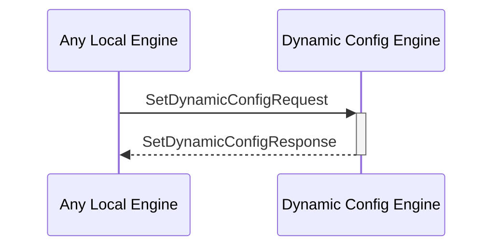

# SetDynamicConfigResponse

## Purpose

<!-- ANCHOR: purpose -->
Response to a [[SetDynamicConfigRequestV1#setdynamicconfigrequestv1]].
<!-- ANCHOR_END: purpose -->

## Type

<!-- ANCHOR: type -->
**Reception:**

[[SetDynamicConfigResponseV1#setdynamicconfigresponsev1]]

{{#include ../types/set-dynamic-config-response-v1.md:type}}

**Triggers**

<!-- ANCHOR_END: type -->

## Behavior

<!-- ANCHOR: behavior -->
Adds a dynamic configuration to the dynamic configuration KV-store.
<!-- ANCHOR_END: behavior -->

## Message Flow

<!-- ANCHOR: messages -->

<!-- ANCHOR_END: messages -->

