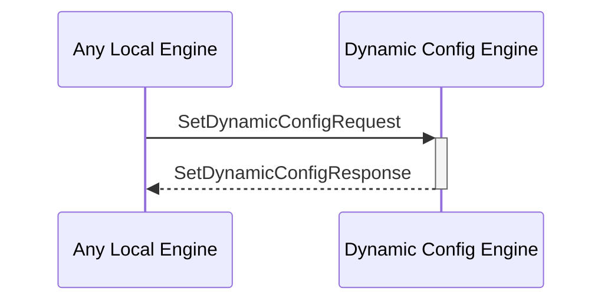

# SetDynamicConfigResponse

## Purpose

<!-- --8<-- [start:purpose] -->
Response to a [[SetDynamicConfigRequestV1#setdynamicconfigrequestv1]].
<!-- --8<-- [end:purpose] -->

## Type

<!-- --8<-- [start:type] -->
**Reception:**

[[SetDynamicConfigResponseV1#setdynamicconfigresponsev1]]

{{#include ../types/set-dynamic-config-response-v1.md:type}}

**Triggers**

<!-- --8<-- [end:type] -->

## Behavior

<!-- --8<-- [start:behavior] -->
Adds a dynamic configuration to the dynamic configuration KV-store.
<!-- --8<-- [end:behavior] -->

## Message Flow

<!-- --8<-- [start:messages] -->

<!-- --8<-- [end:messages] -->

