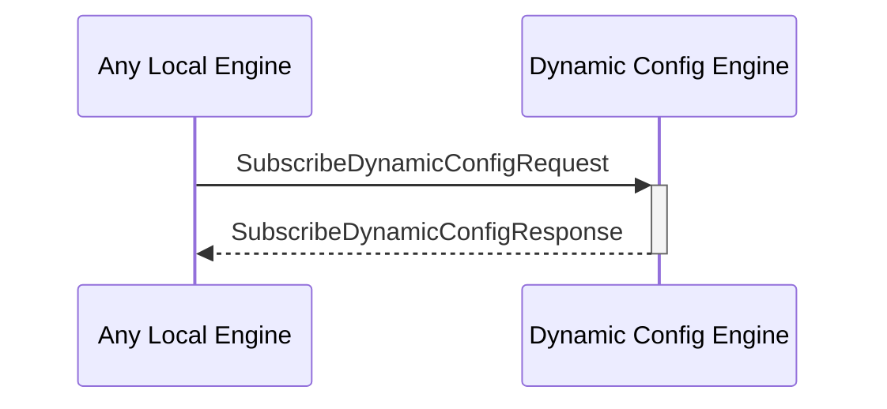

# SubscribeDynamicConfigRequest

## Purpose

<!-- ANCHOR: purpose -->
Subscribe to a dynamic configuration key in the dynamic configuration KV-store to get notified when the corresponding value changes.
<!-- ANCHOR_END: purpose -->

## Type

<!-- ANCHOR: type -->
**Reception:**

[[SubscribeDynamicConfigRequestV1#subscribedynamicconfigrequestv1]]

{{#include ../types/subscribe-dynamic-config-request-v1.md:type}}

**Triggers**

[[SubscribeDynamicConfigResponseV1#subscribedynamicconfigresponseV1]]

{{#include ../types/subscribe-dynamic-config-response-v1.md:type}}

<!-- ANCHOR_END: type -->

## Behavior

<!-- ANCHOR: behavior -->
Subscribes to a key from the dynamic configuration KV-store, to monitor value changes. 
<!-- ANCHOR_END: behavior -->

## Message Flow

<!-- ANCHOR: messages -->

<!-- ANCHOR_END: messages -->

