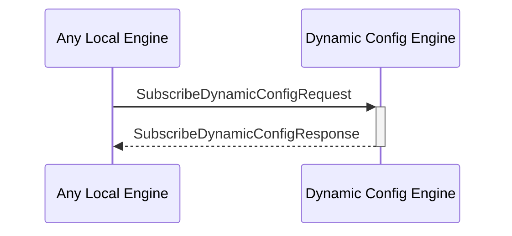

# SubscribeDynamicConfigRequest

## Purpose

<!-- --8<-- [start:purpose] -->
Subscribe to a dynamic configuration key in the dynamic configuration KV-store to get notified when the corresponding value changes.
<!-- --8<-- [end:purpose] -->

## Type

<!-- --8<-- [start:type] -->
**Reception:**

[[SubscribeDynamicConfigRequestV1#subscribedynamicconfigrequestv1]]

{{#include ../types/subscribe-dynamic-config-request-v1.md:type}}

**Triggers**

[[SubscribeDynamicConfigResponseV1#subscribedynamicconfigresponseV1]]

{{#include ../types/subscribe-dynamic-config-response-v1.md:type}}

<!-- --8<-- [end:type] -->

## Behavior

<!-- --8<-- [start:behavior] -->
Subscribes to a key from the dynamic configuration KV-store, to monitor value changes. 
<!-- --8<-- [end:behavior] -->

## Message Flow

<!-- --8<-- [start:messages] -->

<!-- --8<-- [end:messages] -->

