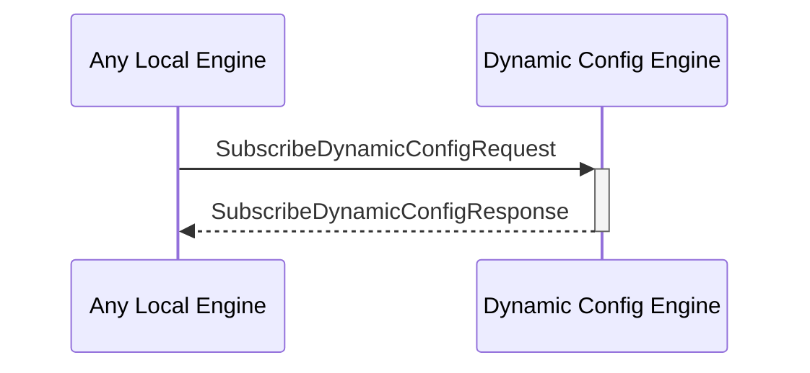

# SubscribeDynamicConfigResponse

## Purpose

<!-- --8<-- [start:purpose] -->
Response to a [[SubscribeDynamicConfigRequest#subscribedynamicconfigrequest|asdfasdf]].
<!-- --8<-- [end:purpose] -->

## Type

<!-- --8<-- [start:type] -->
**Reception:**

[[SubscribeDynamicConfigResponseV1#subscribedynamicconfigresponsev1]]

--8<-- "../types/subscribe-dynamic-config-response-v1.md:type"

**Triggers**

<!-- --8<-- [end:type] -->

## Behavior

<!-- --8<-- [start:behavior] -->
Subscribes to a key from the dynamic configuration KV-store, to monitor value changes.
<!-- --8<-- [end:behavior] -->

## Message Flow

<!-- --8<-- [start:messages] -->

<!-- --8<-- [end:messages] -->

