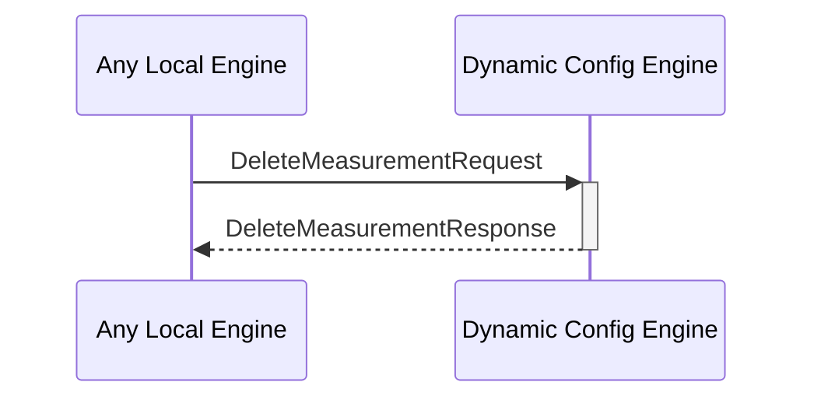

# DeleteMeasurementRequest

## Purpose

<!-- ANCHOR: purpose -->
Find the targeted measurement and delete it from the measurement DB.
<!-- ANCHOR_END: purpose -->

## Type

<!-- ANCHOR: type -->
**Reception:**

[[DeleteMeasurementRequestV1#deletemeasurementrequestv1]]

{{#include ../types/delete-measurement-request-v1.md:type}}

**Triggers**

[[DeleteMeasurementResponseV1#deletemeasurementresponsev1]]

{{#include ../types/delete-measurement-response-v1.md:type}}

<!-- ANCHOR_END: type -->

## Behavior

<!-- ANCHOR: behavior -->
Performs  a removal operation in the measurement DB.
<!-- ANCHOR_END: behavior -->

## Message Flow

<!-- ANCHOR: messages -->

<!-- ANCHOR_END: messages -->

