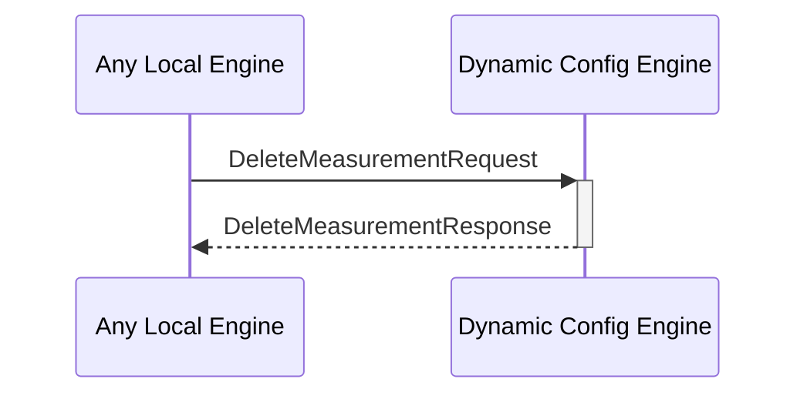

# DeleteMeasurementRequest

## Purpose

<!-- --8<-- [start:purpose] -->
Find the targeted measurement and delete it from the measurement DB.
<!-- --8<-- [end:purpose] -->

## Type

<!-- --8<-- [start:type] -->
**Reception:**

[[DeleteMeasurementRequestV1#deletemeasurementrequestv1]]

--8<-- "../types/delete-measurement-request-v1.md:type"

**Triggers**

[[DeleteMeasurementResponseV1#deletemeasurementresponsev1]]

--8<-- "../types/delete-measurement-response-v1.md:type"

<!-- --8<-- [end:type] -->

## Behavior

<!-- --8<-- [start:behavior] -->
Performs  a removal operation in the measurement DB.
<!-- --8<-- [end:behavior] -->

## Message Flow

<!-- --8<-- [start:messages] -->

<!-- --8<-- [end:messages] -->

