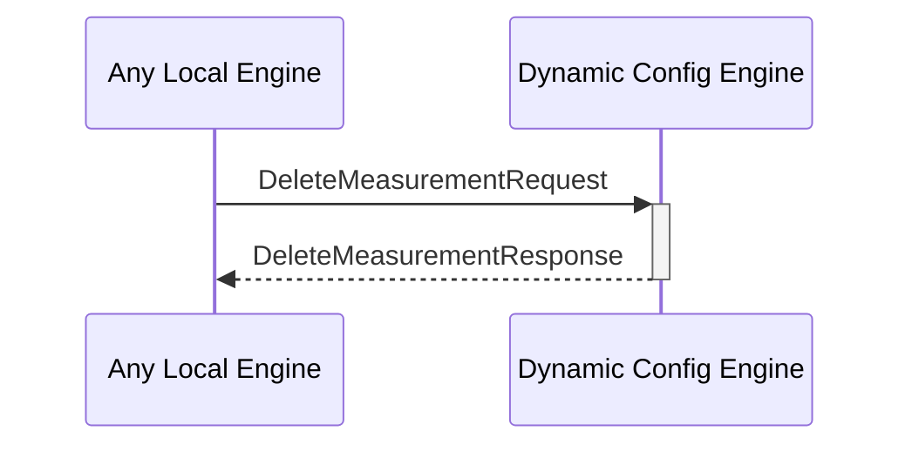

# DeleteMeasurementResponse

## Purpose

<!-- ANCHOR: purpose -->
Response to a [[DeleteMeasurementRequest#deletemeasurementrequest]].
<!-- ANCHOR_END: purpose -->

## Type

<!-- ANCHOR: type -->
**Reception:**

[[DeleteMeasurementResponseV1#deletemeasurementresponsev1]]

{{#include ../types/delete-measurement-response-v1.md:type}}

**Triggers**

<!-- ANCHOR_END: type -->

## Behavior

<!-- ANCHOR: behavior -->
Responds with a message, indicating that the removal operation succeeded or failed. 
<!-- ANCHOR_END: behavior -->

## Message Flow

<!-- ANCHOR: messages -->

<!-- ANCHOR_END: messages -->

