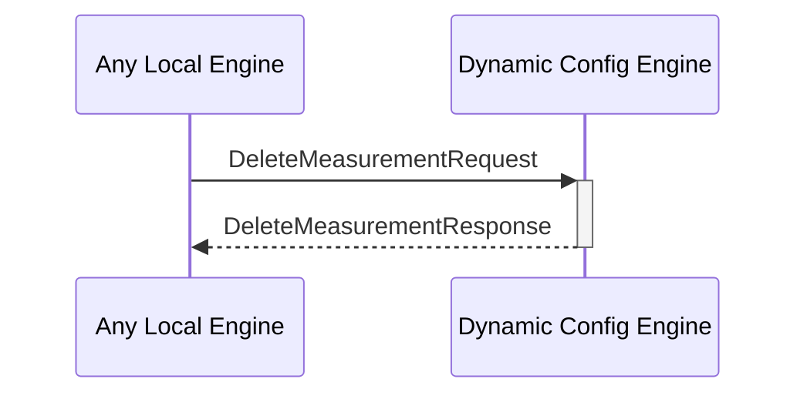

# DeleteMeasurementResponse

## Purpose

<!-- --8<-- [start:purpose] -->
Response to a [[DeleteMeasurementRequest#deletemeasurementrequest]].
<!-- --8<-- [end:purpose] -->

## Type

<!-- --8<-- [start:type] -->
**Reception:**

[[DeleteMeasurementResponseV1#deletemeasurementresponsev1]]

--8<-- "../types/delete-measurement-response-v1.md:type"

**Triggers**

<!-- --8<-- [end:type] -->

## Behavior

<!-- --8<-- [start:behavior] -->
Responds with a message, indicating that the removal operation succeeded or failed.
<!-- --8<-- [end:behavior] -->

## Message Flow

<!-- --8<-- [start:messages] -->

<!-- --8<-- [end:messages] -->

