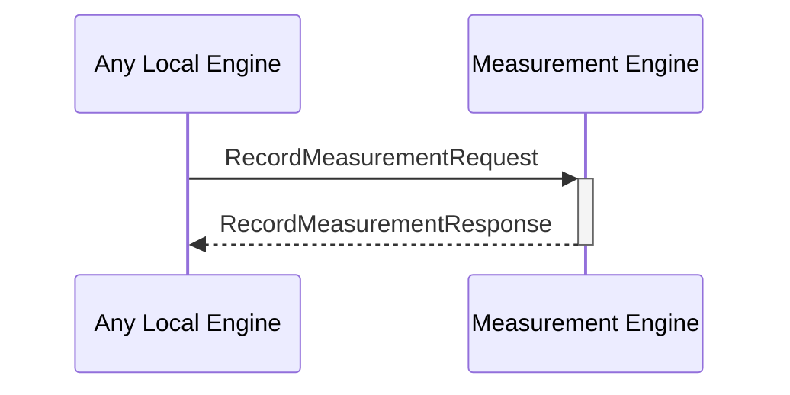

# RecordMeasurementRequest

## Purpose

<!-- ANCHOR: purpose -->
Add a measurement performed by an engine to the measurement database.
<!-- ANCHOR_END: purpose -->

## Type

<!-- ANCHOR: type -->
**Reception:**

[[RecordMeasurementRequestV1#recordmeasurementrequestv1]]

{{#include ../types/record-measurement-request-v1.md:type}}

**Triggers**

[[RecordMeasurementResponseV1#recordmeasurementresponsev1]]

{{#include ../types/record-measurement-response-v1.md:type}}

<!-- ANCHOR_END: type -->

## Behavior

<!-- ANCHOR: behavior -->
Adds a measurement performed by an engine to the measurement database.
<!-- ANCHOR_END: behavior -->

## Message Flow

<!-- ANCHOR: messages -->

<!-- ANCHOR_END: messages -->

