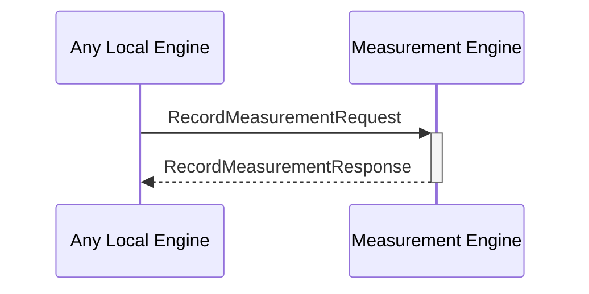

# RecordMeasurementRequest

## Purpose

<!-- --8<-- [start:purpose] -->
Add a measurement performed by an engine to the measurement database.
<!-- --8<-- [end:purpose] -->

## Type

<!-- --8<-- [start:type] -->
**Reception:**

[[RecordMeasurementRequestV1#recordmeasurementrequestv1]]

--8<-- "../types/record-measurement-request-v1.md:type"

**Triggers**

[[RecordMeasurementResponseV1#recordmeasurementresponsev1]]

--8<-- "../types/record-measurement-response-v1.md:type"

<!-- --8<-- [end:type] -->

## Behavior

<!-- --8<-- [start:behavior] -->
Adds a measurement performed by an engine to the measurement database.
<!-- --8<-- [end:behavior] -->

## Message Flow

<!-- --8<-- [start:messages] -->

<!-- --8<-- [end:messages] -->

