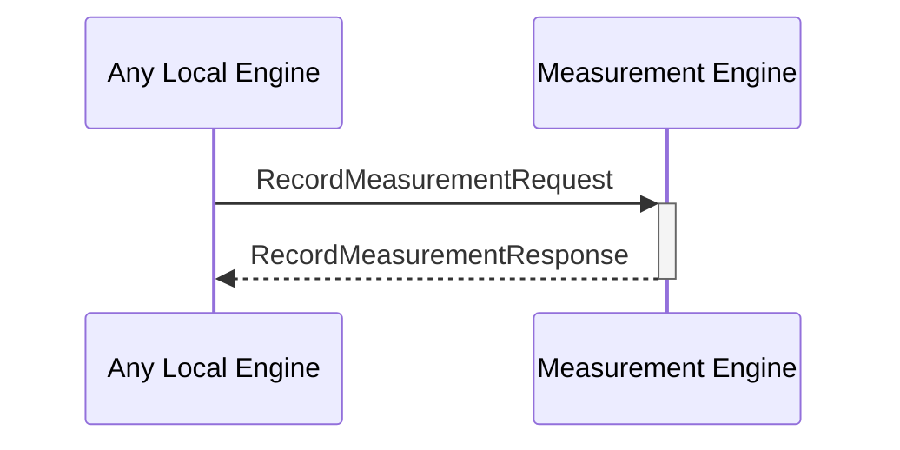

# RecordMeasurementResponse

## Purpose

<!-- --8<-- [start:purpose] -->
After added a measurement performed by an engine to the measurement database, return the result of the operation.
<!-- --8<-- [end:purpose] -->

## Type

<!-- --8<-- [start:type] -->
**Reception:**

[[RecordMeasurementRequestV1#recordmeasurementrequestv1]]

--8<-- "../types/record-measurement-request-v1.md:type"

**Triggers**

<!-- --8<-- [end:type] -->

## Behavior

<!-- --8<-- [start:behavior] -->
Adds a measurement performed by an engine to the measurement database.
<!-- --8<-- [end:behavior] -->

## Message Flow

<!-- --8<-- [start:messages] -->

<!-- --8<-- [end:messages] -->

