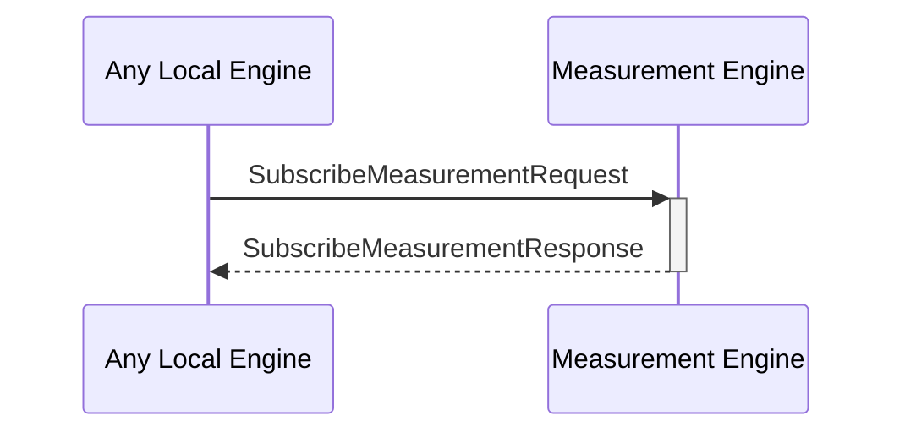

# SubscribeMeasurementRequest

## Purpose

<!-- ANCHOR: purpose -->
Subscribe to a measurement key in the dynamic configuration KV-store to get notified when the corresponding value changes.
<!-- ANCHOR_END: purpose -->

## Type

<!-- ANCHOR: type -->
**Reception:**

[[SubscribeMeasurementRequestV1#subscribemeasurementrequestv1]]

{{#include ../types/subscribe-measurement-request-v1.md:type}}

**Triggers**

[[SubscribeMeasurementResponseV1#subscribemeasurementresponsev1]]

{{#include ../types/subscribe-measurement-response-v1.md:type}}

<!-- ANCHOR_END: type -->

## Behavior

<!-- ANCHOR: behavior -->
Subscribes to a query from the measurement database to monitor value changes.
<!-- ANCHOR_END: behavior -->

## Message Flow

<!-- ANCHOR: messages -->

<!-- ANCHOR_END: messages -->

