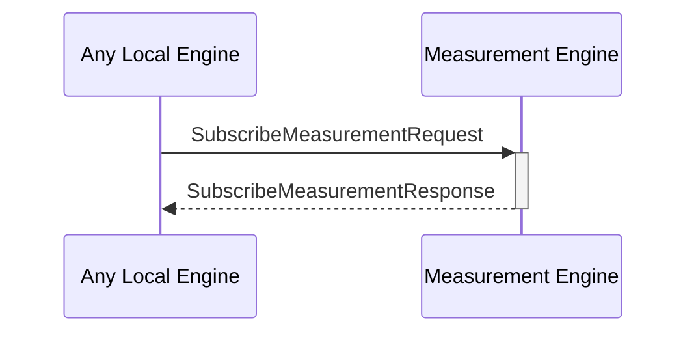

# SubscribeMeasurementResponse

## Purpose

<!-- --8<-- [start:purpose] -->
After subscribed to a measurement key in the dynamic configuration KV-store to get notified when the corresponding value changes,
return a response.
<!-- --8<-- [end:purpose] -->

## Type

<!-- --8<-- [start:type] -->
**Reception:**

[[SubscribeMeasurementResponseV1#subscribemeasurementresponsev1]]

--8<-- "../types/subscribe-measurement-response-v1.md:type"

**Triggers**

<!-- --8<-- [end:type] -->

## Behavior

<!-- --8<-- [start:behavior] -->
Replies with a status after subscribed to a query from the measurement database to monitor value changes.
<!-- --8<-- [end:behavior] -->

## Message Flow

<!-- --8<-- [start:messages] -->

<!-- --8<-- [end:messages] -->

