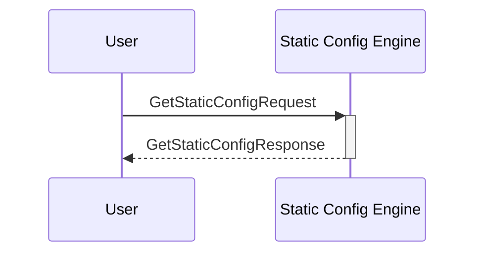

# GetStaticConfigRequest

## Purpose

<!-- ANCHOR: purpose -->
Find a static configuration by its key in the static configuration KV-store and return it.
<!-- ANCHOR_END: purpose -->

## Type

<!-- ANCHOR: type -->
**Reception:**

[[GetStaticConfigRequestV1#getstaticconfigrequestv1]]

{{#include ../types/get-static-config-request-v1.md:type}}

**Triggers**

[[GetStaticConfigResponseV1#getstaticconfigresponsev1]]

{{#include ../types/get-static-config-response-v1.md:type}}

<!-- ANCHOR_END: type -->

## Behavior

<!-- ANCHOR: behavior -->
Performs the requested search operation in the static configurations KV-store and returns the value.
<!-- ANCHOR_END: behavior -->

## Message Flow

<!-- ANCHOR: messages -->

<!-- ANCHOR_END: messages -->

