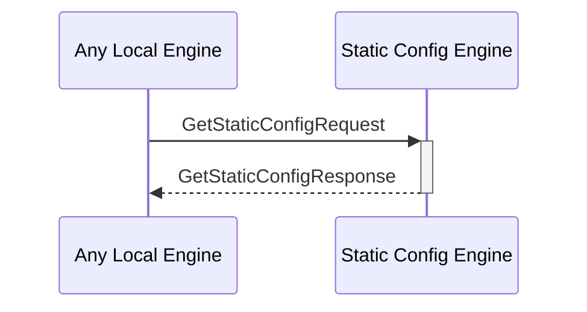

# GetStaticConfigResponse

## Purpose

<!-- --8<-- [start:purpose] -->
After find a static configuration by its key in the static configuration KV-store and return the corresponding key-value pair.
<!-- --8<-- [end:purpose] -->

## Type

<!-- --8<-- [start:type] -->
**Reception:**

[[GetStaticConfigRequestV1#getstaticconfigrequestv1]]

{{#include ../types/get-static-config-request-v1.md:type}}

**Triggers**

[[GetStaticConfigResponseV1#getstaticconfigresponsev1]]

{{#include ../types/get-static-config-response-v1.md:type}}

<!-- --8<-- [end:type] -->

## Behavior

<!-- --8<-- [start:behavior] -->
Performs the requested search operation in the static configurations KV-store and returns the value.
<!-- --8<-- [end:behavior] -->

## Message Flow

<!-- --8<-- [start:messages] -->

<!-- --8<-- [end:messages] -->

