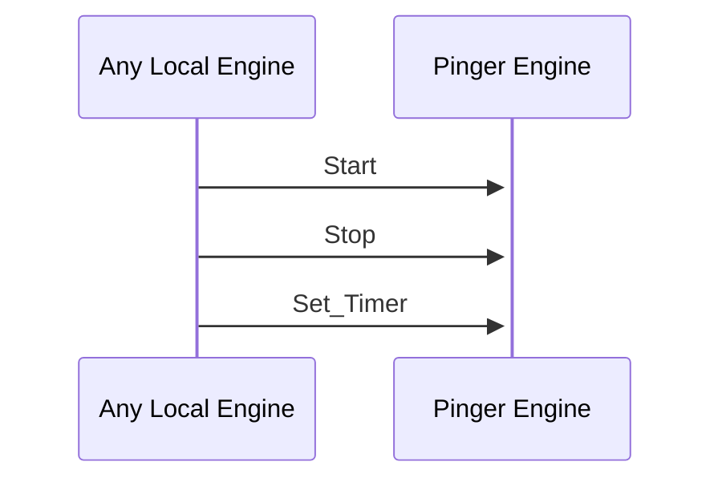

# Dumper Engine

## Overall Philosophy

Snapshotting is an important functionality for Anoma. To make sure that the snapshotting is done systematically, we introduce a robust Dumper engine. The Engine asks for the system to dump all of its core data to snapshot the system once a certain number of block are executed.

That is, the user can set the system to snapshot on every n-th block creation.

## Initialization

To initialize the engine, we need to specify a non-negative integer. Given such an integer `n` we will then ask to dump state once an executed block will have number divisible by `n` (assuming the first block created bears number 1).

Other than that, we need access to the configuration engine in order to ask it for the path where to store the snapshot, the task field, which tracks the current asyncronous process keeping track of block execution.

## State

The state types are provided as follows:

- `field(:count, non_neg_integer(), enforce: false)`
  *Specify how many blocks pass between snapshotting*
- `field(:configuration, Router.Addr.t())`
  *The address of the configuration engine*
- `field(:task, Task.t(), enforce: false)`
  *The task engaged in waiting for the apporpriate block execution and directly asking for a system snapshot*

## Public API

# Start

## Purpose

Starts a dumping loop based on the count supplied. If an old task was present before the sturt, it gets killed. If no count is provided, return a state with empty count and task.

## Type

**Input**

 - `Router.Addr.t()`
   *Dumper Address*

**Output**

 No user-visible output on succsess.

# Stop

I shutdown the dumper task given in the Engine field.

**Input**

- `Router.Addr.t()`
  *Dumper Engine Address*

**Output**

No user-visible output on success.

# Set_Count

## Purpose

The `Set_Count` function changes the count field of the given dumper engine. It shutdowns the task in the initially given state, starting a new one with the changed count parameter, registering both new task and the new count settings in the state.

If the count is a non-positive integer, the function does nothing while if the fed count is nil, then it sets both the count and task to nil.

**Input**

- `Router.Addr.t()`
  *Address of the Dumper ENgine*
- `non_neg_integer() | nil`
  *New count*

**Output**

No use-observable output on success.

## Message Flow

 <!-- --8<-- [start:messages] -->

 <!-- --8<-- [end:messages] -->
