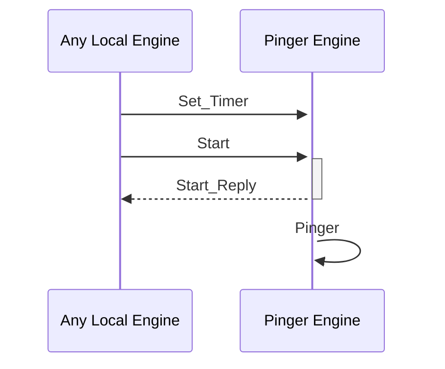

# Pinger Engine

## Overall Philosophy

The Pinger Engine is designed to provide a functionality of a scheduled Mempool
executor. Keeping track of the Mempool Engine address and the timer set, it
calls for the Mempool to execute every specified amount of time.

## Initialization

The Engine requires one input, namely the Mempool address. The user may also
provide a non-negative integer for the time information of the engine. If no
argument is given, we assume that no timer is set.

## State

The state types are provided as follows:

## State

The state types are provided as follows:

- `field(:mempool, Router.Addr.t())`
  *Mempool Address*

- `field(:time, non_neg_integer() | atom(), default: :no_timer)`
  *Timer field*

## Public API

# Set_Timer

## Purpose

Sets the timer which the clock uses to schedule how frequently to ask Mempool
for execution.

## Type

**Input**

 - `Router.Addr.t()``
   *Router address of the mempool*
 - `non_neg_integer() | :no_timer`
   *Timer for the Engine*

**Output**

  No user-visible output on success

# Start

Starts the pinger process. If no timer is specified, send a default message. Otherwise, send message to itself after the specified time. Namely it launches the `pinger` function.

**Input**

- `Router.Addr.t()`
  *An address of the Pinger Engine the user wants to start*

**Output*

- `String.t()`
  *Message specifying succesful launch*

# Pinger

## Purpose

The `pinger` function asks for a timer feed. If no timer is specified, sends a base message to the user. Otherwise asks to send an `execute` message to the pinger itself after a specified ammount of time.

**Input**

- `:no_timer | non_neg_integer()`
  *Either the messgae specifying no timer or an integer specifying time setting*

**Output**

- `:ok | reference()`
  *Either returns a base message in case no timer is set or sends a classical reference*

## Message Flow

 <!-- --8<-- [start:messages] -->

 <!-- --8<-- [end:messages] -->
