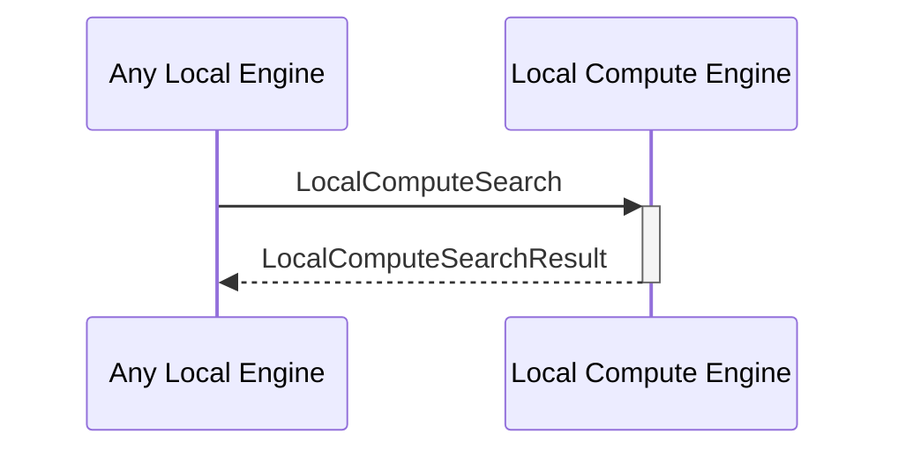

# LocalComputeSearchResult

## Purpose

<!-- --8<-- [start:purpose] -->
After performing a search operation based on a given predicate within a specified time limit (timeout), return the result.
<!-- --8<-- [end:purpose] -->

## Type

<!-- --8<-- [start:type] -->
**Reception:**

[[LocalComputeSearchV1#localcomputesearchv1]]

--8<-- "../types/local-compute-search-v1.md:type"

**Triggers**

<!-- --8<-- [end:type] -->

## Behavior

<!-- --8<-- [start:behavior] -->
After performing the search operation, return the computation results.
<!-- --8<-- [end:behavior] -->

## Message Flow

<!-- --8<-- [start:messages] -->

<!-- --8<-- [end:messages] -->

