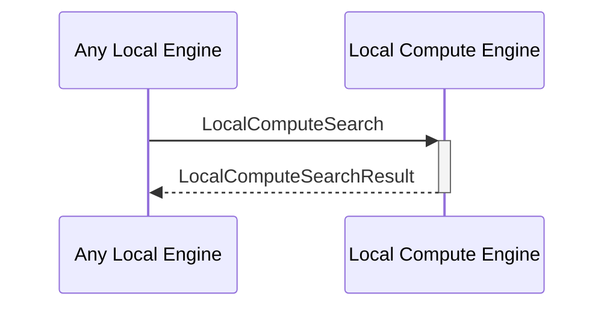

# LocalComputeSearchResult

## Purpose

<!-- ANCHOR: purpose -->
After performing a search operation based on a given predicate within a specified time limit (timeout), return the result.
<!-- ANCHOR_END: purpose -->

## Type

<!-- ANCHOR: type -->
**Reception:**

[[LocalComputeSearchV1#localcomputesearchv1]]

{{#include ../types/local-compute-search-v1.md:type}}

**Triggers**

<!-- ANCHOR_END: type -->

## Behavior

<!-- ANCHOR: behavior -->
After performing the search operation, return the computation results.
<!-- ANCHOR_END: behavior -->

## Message Flow

<!-- ANCHOR: messages -->

<!-- ANCHOR_END: messages -->

