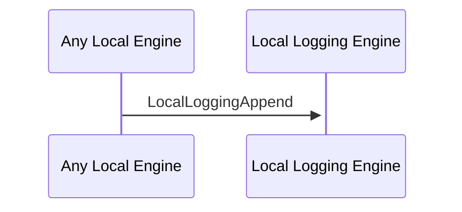

# LocalLoggingAppend

## Purpose

<!-- ANCHOR: purpose -->
Append new values to the logbook.
<!-- ANCHOR_END: purpose -->

## Type

<!-- ANCHOR: type -->
**Reception:**

### [[LocalLoggingAppendV1#localloggingappendV1]]

{{#include ../types/local-logging-append-v1.md:type}}

**Triggers:**

<!-- ANCHOR_END: type -->

## Behavior

<!-- ANCHOR: behavior -->
Appends the new value to the logbook.
<!-- ANCHOR_END: behavior -->

## Message Flow

<!-- ANCHOR: messages -->

<!-- ANCHOR_END: messages -->

