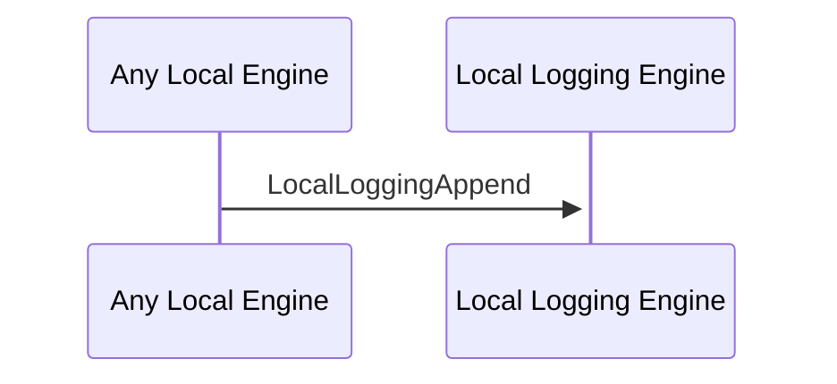

# LocalLoggingAppend

## Purpose

<!-- --8<-- [start:purpose] -->
Append new values to the logbook.
<!-- --8<-- [end:purpose] -->

## Type

<!-- --8<-- [start:type] -->
**Reception:**

### [[LocalLoggingAppendV1#localloggingappendV1]]

--8<-- "../types/local-logging-append-v1.md:type"

**Triggers:**

<!-- --8<-- [end:type] -->

## Behaviour

<!-- --8<-- [start:behaviour] -->
Appends the new value to the logbook.
<!-- --8<-- [end:behaviour] -->

## Message Flow

<!-- --8<-- [start:messages] -->

<!-- --8<-- [end:messages] -->

