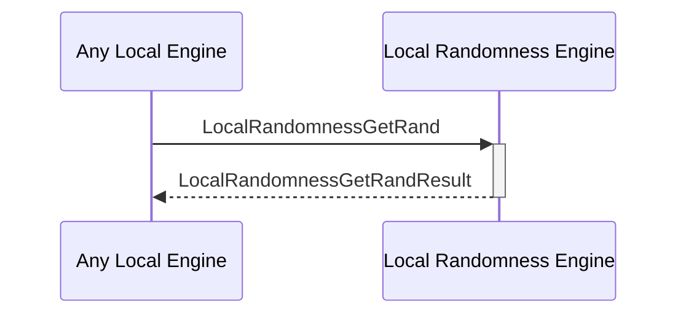

# LocalRandomnessGetRandResult

## Purpose

<!-- --8<-- [start:purpose] -->
Return the generated random numbers or other random data locally on the physical machine that the Anoma node is running.
<!-- --8<-- [end:purpose] -->

## Type

<!-- --8<-- [start:type] -->
**Reception:**

[[LocalRandomnessGetRandResultV1#localrandomnessgetrandresultv1]]

--8<-- "../types/local-randomness-get-rand-result-v1.md:type"

**Triggers**

<!-- --8<-- [end:type] -->

## Behavior

<!-- --8<-- [start:behavior] -->
Return the generated random number or other random data.
<!-- --8<-- [end:behavior] -->

## Message Flow

<!-- --8<-- [start:messages] -->

<!-- --8<-- [end:messages] -->

