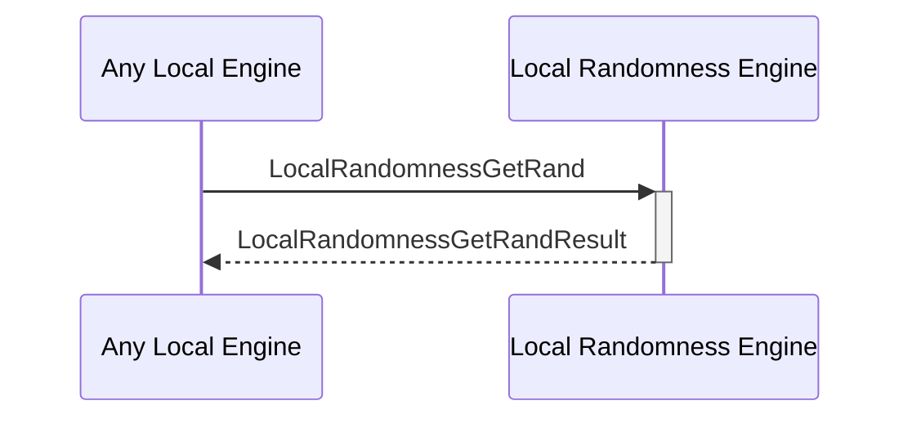

# LocalRandomnessGetRand

## Purpose

<!-- ANCHOR: purpose -->
Generate random numbers or other random data locally on the physical machine that the Anoma node is running.
<!-- ANCHOR_END: purpose -->

## Type

<!-- ANCHOR: type -->
**Reception:**

[[LocalRandomnessGetRandV1#localrandomnessgetrandv1]]

{{#include ../types/local-randomness-get-rand-v1.md:type}}

**Triggers**

[[LocalRandomnessGetRandResultV1#localrandomnessgetrandresultv1]]

{{#include ../types/local-randomness-get-rand-result-v1.md:type}}

<!-- ANCHOR_END: type -->

## Behavior

<!-- ANCHOR: behavior -->
Generates a random number or other random data.
<!-- ANCHOR_END: behavior -->

## Message Flow

<!-- ANCHOR: messages -->

<!-- ANCHOR_END: messages -->

