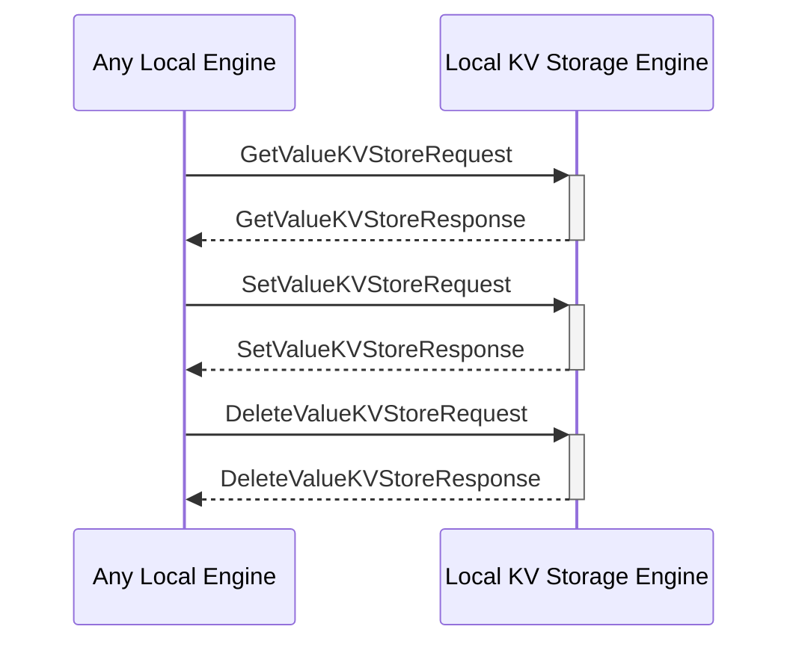

# Local Key-Value Storage Engine

## Purpose

The *Local Key-Value Storage Engine* provides the local storage and retrieval of data in a key-value format. 

## State

## Messages received

### [[GetValueKVStoreRequest#getvaluekvstorerequest]]

{{#include local-kv-storage-engine/messages/get-value-KVStore-request.md:purpose}}

{{#include local-kv-storage-engine/messages/get-value-KVStore-request.md:type}}

### [[SetValueKVStoreRequest#setvaluekvstorerequest]]

{{#include local-kv-storage-engine/messages/set-value-KVStore-request.md:purpose}}

{{#include local-kv-storage-engine/messages/set-value-KVStore-request.md:type}}

### [[DeleteValueKVStoreRequest#deletevaluekvstorerequest]]

{{#include local-kv-storage-engine/messages/delete-value-KVStore-request.md:purpose}}

{{#include local-kv-storage-engine/messages/delete-value-KVStore-request.md:type}}

## Notifications sent

### [[ValueChangedKVStore#valuechangedkvstore]]

{{#include local-kv-storage-engine/notifications/value-changed-KVStore.md:purpose}}

{{#include local-kv-storage-engine/notifications/value-changed-KVStore.md:type}}

## Message Flow

 <!-- ANCHOR: messages -->

 <!-- ANCHOR_END: messages -->

