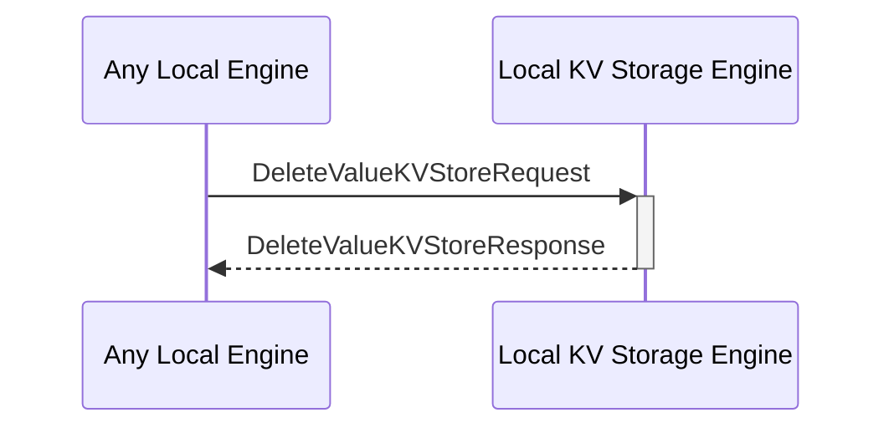

# DeleteValueKVStoreRequest

## Purpose

<!-- ANCHOR: purpose -->
Find a value by its key in the KV-store and delete both the key and the value.

<!-- ANCHOR_END: purpose -->

## Type

<!-- ANCHOR: type -->
**Reception:**

[[DeleteValueKVStoreRequestV1#deletevaluekvstorerequestv1]]

{{#include ../types/delete-value-KVStore-request-v1.md:type}}

**Triggers**

[[DeleteValueKVStoreResponseV1#deletevaluekvstoreresponsev1]]

{{#include ../types/delete-value-KVStore-response-v1.md:type}}

<!-- ANCHOR_END: type -->

## Behavior

<!-- ANCHOR: behavior -->
Finds a value by its key in the KV-store and delete both the key and the value.

<!-- ANCHOR_END: behavior -->

## Message Flow

<!-- ANCHOR: messages -->

<!-- ANCHOR_END: messages -->

