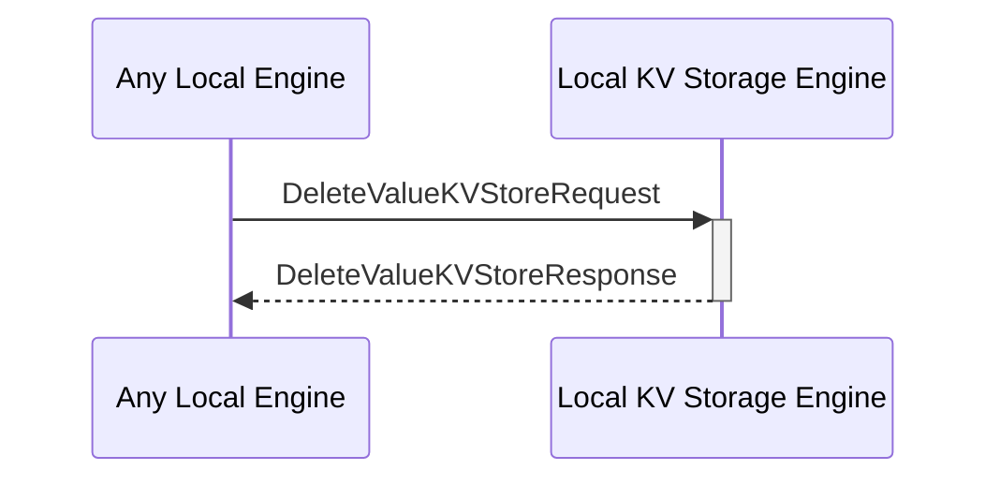

# DeleteValueKVStoreRequest

## Purpose

<!-- --8<-- [start:purpose] -->
Prevent actors capable of sending read requests to the Storage Engine to
be able to read a previously set value for a specified key.

<!-- --8<-- [end:purpose] -->

## Type

<!-- --8<-- [start:type] -->
**Reception:**

[[DeleteValueKVStoreRequestV1#deletevaluekvstorerequestv1]]

--8<-- "../types/delete-value-KVStore-request-v1.md:type"

**Triggers**

[[DeleteValueKVStoreResponseV1#deletevaluekvstoreresponsev1]]

--8<-- "../types/delete-value-KVStore-response-v1.md:type"

<!-- --8<-- [end:type] -->

## Behaviour

<!-- --8<-- [start:behaviour] -->
Finds a value by its key in the KV-store and modifies the reading
capabilities related to said key availiable through the Storage API.

The behavior is tied directly to reading capabilities of the Storage Engine
and hence can be described via interaction with GetValueKVStore as follows:

If [[DeleteValueKVStoreRequestV1#deletevaluekvstorerequestv1]] was sent
with key `key` specified and
[[DeleteValueKVStoreResponseV1#deletevaluekvstoreresponsev1]] returns a
success then [[GetValueKVStoreRequestV1#getvaluekvstorerequestv1]] sent
with key `key` will trigger a `Nothing` response.

<!-- --8<-- [end:behaviour] -->

## Message Flow

<!-- --8<-- [start:messages] -->

<!-- --8<-- [end:messages] -->

