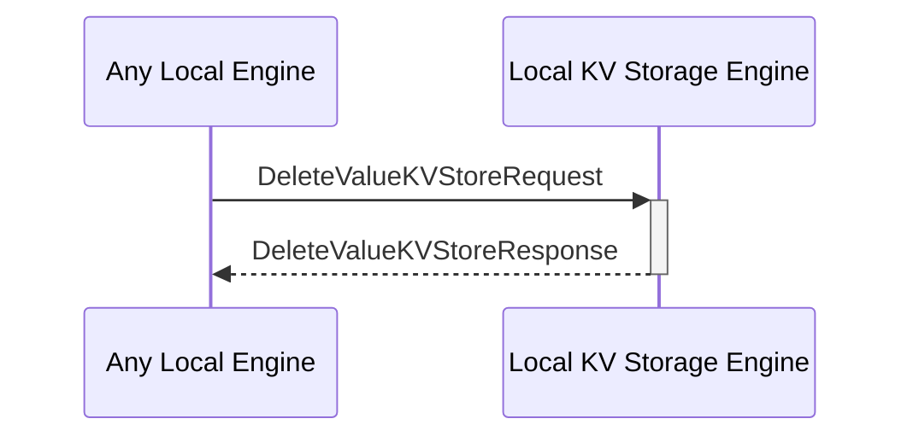

# DeleteValueKVStoreRequest

## Purpose

<!-- --8<-- [start:purpose] -->
Find a value by its key in the KV-store and delete both the key and the value.

<!-- --8<-- [end:purpose] -->

## Type

<!-- --8<-- [start:type] -->
**Reception:**

[[DeleteValueKVStoreRequestV1#deletevaluekvstorerequestv1]]

--8<-- "../types/delete-value-KVStore-request-v1.md:type"

**Triggers**

[[DeleteValueKVStoreResponseV1#deletevaluekvstoreresponsev1]]

--8<-- "../types/delete-value-KVStore-response-v1.md:type"

<!-- --8<-- [end:type] -->

## Behavior

<!-- --8<-- [start:behavior] -->
Finds a value by its key in the KV-store and delete both the key and the value.

<!-- --8<-- [end:behavior] -->

## Message Flow

<!-- --8<-- [start:messages] -->

<!-- --8<-- [end:messages] -->

