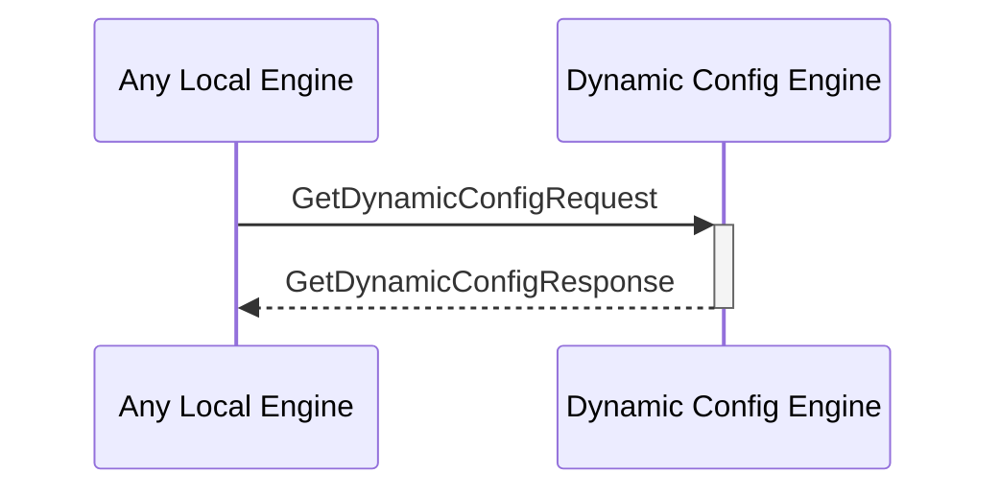

# DeleteValueKVStoreResponse

## Purpose

<!-- ANCHOR: purpose -->
Response to [[DeleteValueKVStoreRequest#deletevaluekvstorerequest]].
<!-- ANCHOR_END: purpose -->

## Type

<!-- ANCHOR: type -->
**Reception:**

[[DeleteValueKVStoreRequestV1#deletevaluekvstorerequestv1]]

{{#include ../types/delete-value-KVStore-response-v1.md:type}}

**Triggers**

<!-- ANCHOR_END: type -->

## Behavior

<!-- ANCHOR: behavior -->
After deleting the KV-pair from the KV-store, send a message indicating the success or failure of the operation.
<!-- ANCHOR_END: behavior -->

## Message Flow

<!-- ANCHOR: messages -->

<!-- ANCHOR_END: messages -->

