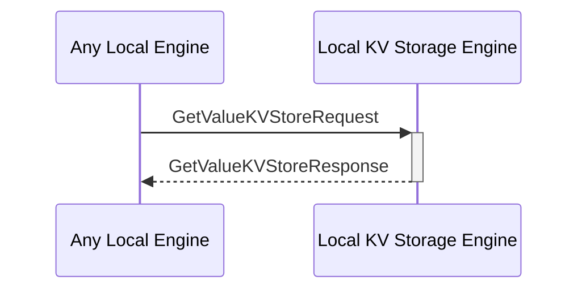

# GetValueKVStoreRequest

## Purpose

<!-- ANCHOR: purpose -->
Find stored data by its key in the KV-store and return the value.

<!-- ANCHOR_END: purpose -->

## Type

<!-- ANCHOR: type -->
**Reception:**

[[GetValueKVStoreRequestV1#getvaluekvstorerequestv1]]

{{#include ../types/get-value-KVStore-request-v1.md:type}}

**Triggers**

[[GetValueKVStoreResponseV1#getvaluekvstoreresponsev1]]

{{#include ../types/get-value-KVStore-response-v1.md:type}}

<!-- ANCHOR_END: type -->

## Behavior

<!-- ANCHOR: behavior -->
Performs a key-based search operation in the KV-store to find the corresponding value.
<!-- ANCHOR_END: behavior -->

## Message Flow

<!-- ANCHOR: messages -->

<!-- ANCHOR_END: messages -->

