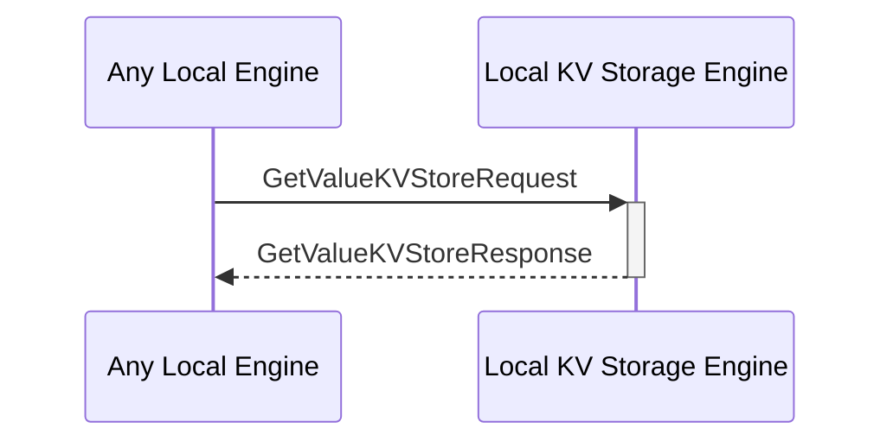

# GetValueKVStoreRequest

## Purpose

<!-- --8<-- [start:purpose] -->
Find stored data by its key in the KV-store and return the value.

<!-- --8<-- [end:purpose] -->

## Type

<!-- --8<-- [start:type] -->
**Reception:**

[[GetValueKVStoreRequestV1#getvaluekvstorerequestv1]]

--8<-- "../types/get-value-KVStore-request-v1.md:type"

**Triggers**

[[GetValueKVStoreResponseV1#getvaluekvstoreresponsev1]]

--8<-- "../types/get-value-KVStore-response-v1.md:type"

<!-- --8<-- [end:type] -->

## Behavior

<!-- --8<-- [start:behavior] -->
Performs a key-based search operation in the KV-store to find the corresponding value.
<!-- --8<-- [end:behavior] -->

## Message Flow

<!-- --8<-- [start:messages] -->

<!-- --8<-- [end:messages] -->

