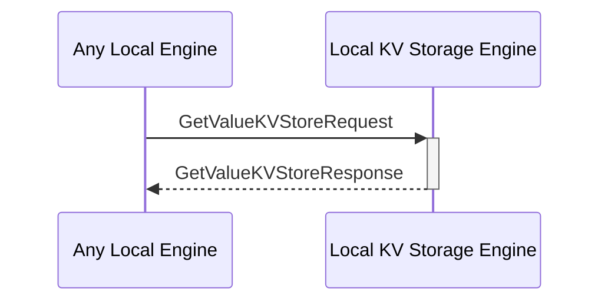

# GetValueKVStoreResponse

## Purpose

<!-- ANCHOR: purpose -->
Return the value from the search operation which is triggered by a
[[GetValueKVStoreRequest#getvaluekvstorerequest]].

<!-- ANCHOR_END: purpose -->

## Type

<!-- ANCHOR: type -->
**Reception:**

[[GetValueKVStoreResponseV1#getvaluekvstoreresponsev1]]

{{#include ../types/get-value-KVStore-response-v1.md:type}}

**Triggers**

<!-- ANCHOR_END: type -->

## Behavior

<!-- ANCHOR: behavior -->
Returns the value from the search operation which is triggered by a 
[[GetValueKVStoreRequest#getvaluekvstorerequest]].

<!-- ANCHOR_END: behavior -->

## Message Flow

<!-- ANCHOR: messages -->

<!-- ANCHOR_END: messages -->

