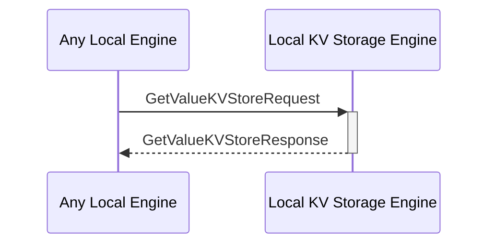

# GetValueKVStoreResponse

## Purpose

<!-- --8<-- [start:purpose] -->
Return the value from the search operation which is triggered by a
[[GetValueKVStoreRequest#getvaluekvstorerequest]].

<!-- --8<-- [end:purpose] -->

## Type

<!-- --8<-- [start:type] -->
**Reception:**

[[GetValueKVStoreResponseV1#getvaluekvstoreresponsev1]]

--8<-- "../types/get-value-KVStore-response-v1.md:type"

**Triggers**

<!-- --8<-- [end:type] -->

## Behavior

<!-- --8<-- [start:behavior] -->
Returns the value from the search operation which is triggered by a 
[[GetValueKVStoreRequest#getvaluekvstorerequest]].

<!-- --8<-- [end:behavior] -->

## Message Flow

<!-- --8<-- [start:messages] -->

<!-- --8<-- [end:messages] -->

