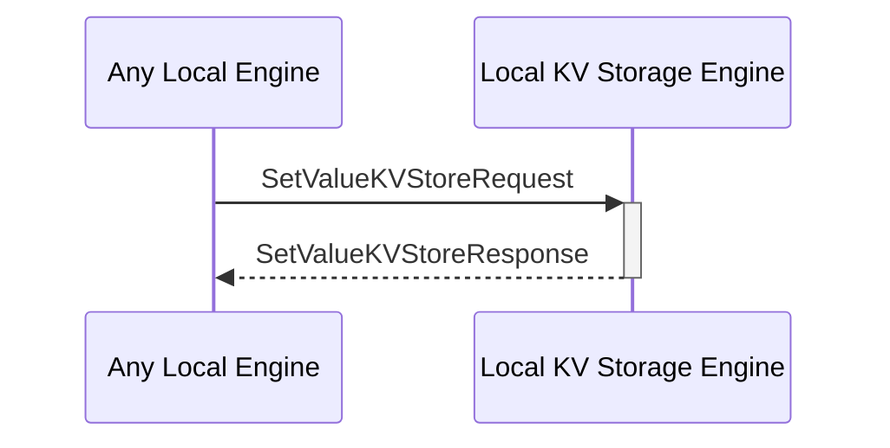

# SetValueKVStoreRequest

## Purpose

<!-- ANCHOR: purpose -->
Add a piece of data to the KV store by adding its key and the corresponding value. 
If the key already exists, override the value. 
<!-- ANCHOR_END: purpose -->

## Type

<!-- ANCHOR: type -->
**Reception:**

[[SetValueKVStoreRequestV1#setvaluekvstorerequestv1]]

{{#include ../types/set-value-KVStore-request-v1.md:type}}

**Triggers**

[[SetValueKVStoreResponseV1#setvaluekvstoreresponsev1]]

{{#include ../types/set-value-KVStore-response-v1.md:type}}

<!-- ANCHOR_END: type -->

## Behavior

<!-- ANCHOR: behavior -->
Adds a piece of data to the KV store by inserting its key and the corresponding value.
If the key already exists, it overrides the value.
<!-- ANCHOR_END: behavior -->

## Message Flow

<!-- ANCHOR: messages -->

<!-- ANCHOR_END: messages -->

