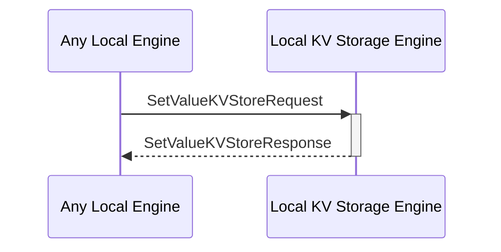

# SetValueKVStoreRequest

## Purpose

<!-- --8<-- [start:purpose] -->
Add a piece of data to the KV store by adding its key and the corresponding value. 
If the key already exists, override the value. 
<!-- --8<-- [end:purpose] -->

## Type

<!-- --8<-- [start:type] -->
**Reception:**

[[SetValueKVStoreRequestV1#setvaluekvstorerequestv1]]

--8<-- "../types/set-value-KVStore-request-v1.md:type"

**Triggers**

[[SetValueKVStoreResponseV1#setvaluekvstoreresponsev1]]

--8<-- "../types/set-value-KVStore-response-v1.md:type"

<!-- --8<-- [end:type] -->

## Behavior

<!-- --8<-- [start:behavior] -->
Adds a piece of data to the KV store by inserting its key and the corresponding value.
If the key already exists, it overrides the value.
<!-- --8<-- [end:behavior] -->

## Message Flow

<!-- --8<-- [start:messages] -->

<!-- --8<-- [end:messages] -->

