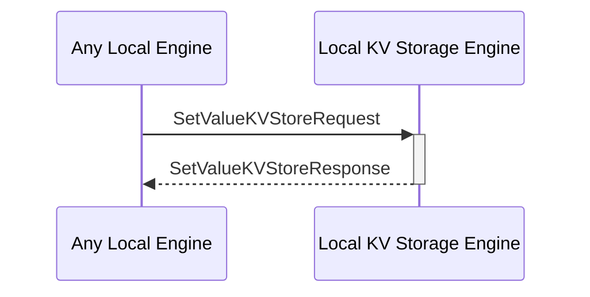

# SetValueKVStoreResponse

## Purpose

<!-- ANCHOR: purpose -->
Response to a [[SetValueKVStoreRequest#setvaluekvstorerequest]].

<!-- ANCHOR_END: purpose -->

## Type

<!-- ANCHOR: type -->
**Reception:**

[[SetValueKVStoreResponseV1#setvaluekvstoreresponsev1]]

{{#include ../types/set-value-KVStore-response-v1.md:type}}

**Triggers**

<!-- ANCHOR_END: type -->

## Behavior

<!-- ANCHOR: behavior -->
After adding the KV-pair to the KV-store, send a message indicating the success or failure of the operation.
<!-- ANCHOR_END: behavior -->

## Message Flow

<!-- ANCHOR: messages -->

<!-- ANCHOR_END: messages -->

