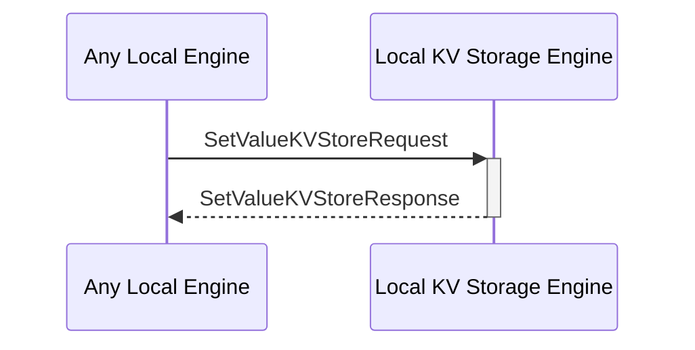

# SetValueKVStoreResponse

## Purpose

<!-- --8<-- [start:purpose] -->
Response to a [[SetValueKVStoreRequest#setvaluekvstorerequest]].

<!-- --8<-- [end:purpose] -->

## Type

<!-- --8<-- [start:type] -->
**Reception:**

[[SetValueKVStoreResponseV1#setvaluekvstoreresponsev1]]

--8<-- "../types/set-value-KVStore-response-v1.md:type"

**Triggers**

<!-- --8<-- [end:type] -->

## Behavior

<!-- --8<-- [start:behavior] -->
After adding the KV-pair to the KV-store, send a message indicating the success or failure of the operation.
<!-- --8<-- [end:behavior] -->

## Message Flow

<!-- --8<-- [start:messages] -->

<!-- --8<-- [end:messages] -->

