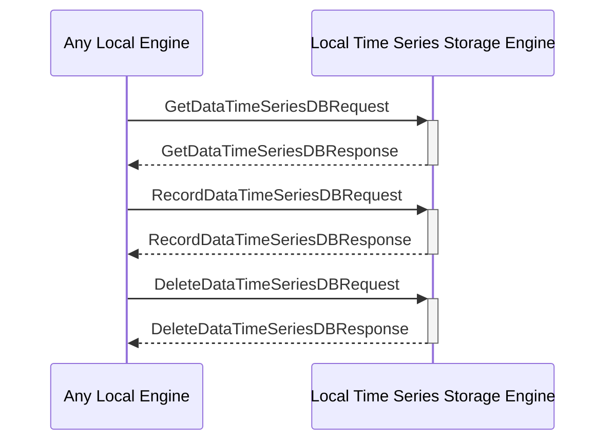

# Local Time Series Storage Engine

## Purpose

The *Local Time Series Storage Engine* provides local storage and retrieval of time series data.

## State

## Messages received

### [[GetDataTimeSeriesDBRequest#getdatatimeseriesdbrequest]]

--8<-- "local-timeseries-storage-engine/messages/get-data-time-series-DB-request.md:purpose"

--8<-- "local-timeseries-storage-engine/messages/get-data-time-series-DB-request.md:type"

### [[RecordDataTimeSeriesDBRequest#recorddatatimeseriesdbrequest]]

--8<-- "local-timeseries-storage-engine/messages/record-data-time-series-DB-request.md:purpose"

--8<-- "local-timeseries-storage-engine/messages/record-data-time-series-DB-request.md:type"

### [[DeleteDataTimeSeriesDBRequest#deletedatatimeseriesdbrequest]]

--8<-- "local-timeseries-storage-engine/messages/delete-data-time-series-DB-request.md:purpose"

--8<-- "local-timeseries-storage-engine/messages/delete-data-time-series-DB-request.md:type"

## Notifications sent

### [[DataChangedTimeSeriesDB#datachangedtimeseriesdb]]

--8<-- "local-timeseries-storage-engine/notifications/data-changed-time-series-DB.md:purpose"

--8<-- "local-timeseries-storage-engine/notifications/data-changed-time-series-DB.md:type"

## Message Flow

<!-- --8<-- [start:messages] -->

<!-- --8<-- [end:messages] -->

