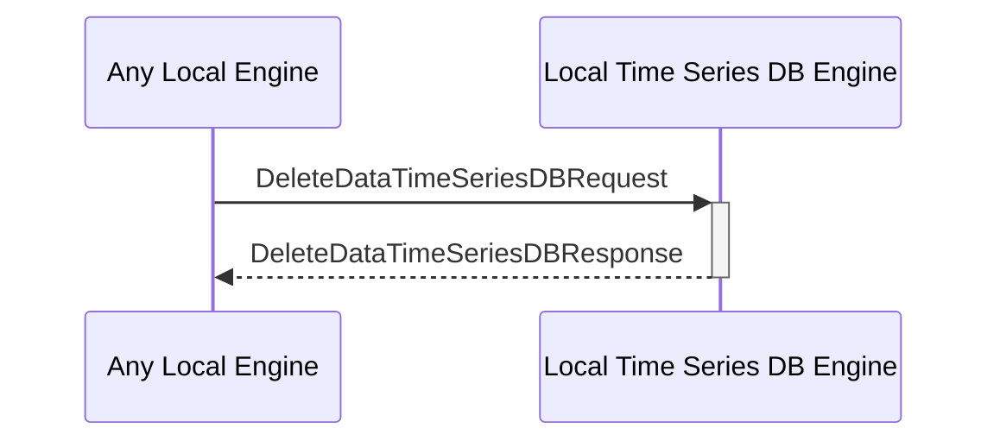

# DeleteDataTimeSeriesDBRequest

## Purpose

<!-- --8<-- [start:purpose] -->
Delete time series data from the DB.
<!-- --8<-- [end:purpose] -->

## Type

<!-- --8<-- [start:type] -->
**Reception:**

[[DeleteDataTimeSeriesDBRequestV1#deletedatatimeseriesdbrequestv1]]

{{#include ../types/delete-data-time-series-DB-request-v1.md:type}}

**Triggers**

[[DeleteDataTimeSeriesDBResponseV1#deletedatatimeseriesdbresponsev1]]

{{#include ../types/delete-data-time-series-DB-response-v1.md:type}}

<!-- --8<-- [end:type] -->

## Behavior

<!-- --8<-- [start:behavior] -->
Delete time series data from the time series DB.
<!-- --8<-- [end:behavior] -->

## Message Flow

<!-- --8<-- [start:messages] -->

<!-- --8<-- [end:messages] -->

