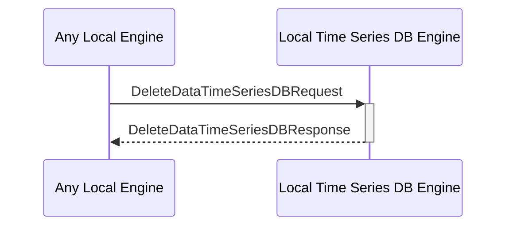

# RecordDataTimeSeriesDBResponse

## Purpose

<!-- --8<-- [start:purpose] -->
Response to a [[DeleteDataTimeSeriesDBRequest#deletedatatimeseriesdbrequest]].
<!-- --8<-- [end:purpose] -->

## Type

<!-- --8<-- [start:type] -->
**Reception:**

[[DeleteDataTimeSeriesDBResponseV1#deletedatatimeseriesdbresponsev1]]

--8<-- "../types/delete-data-time-series-DB-response-v1.md:type"

**Triggers**

<!-- --8<-- [end:type] -->

## Behavior

<!-- --8<-- [start:behavior] -->
Performs the requested data record delete operation in the time series DB.
<!-- --8<-- [end:behavior] -->

## Message Flow

<!-- --8<-- [start:messages] -->

<!-- --8<-- [end:messages] -->

