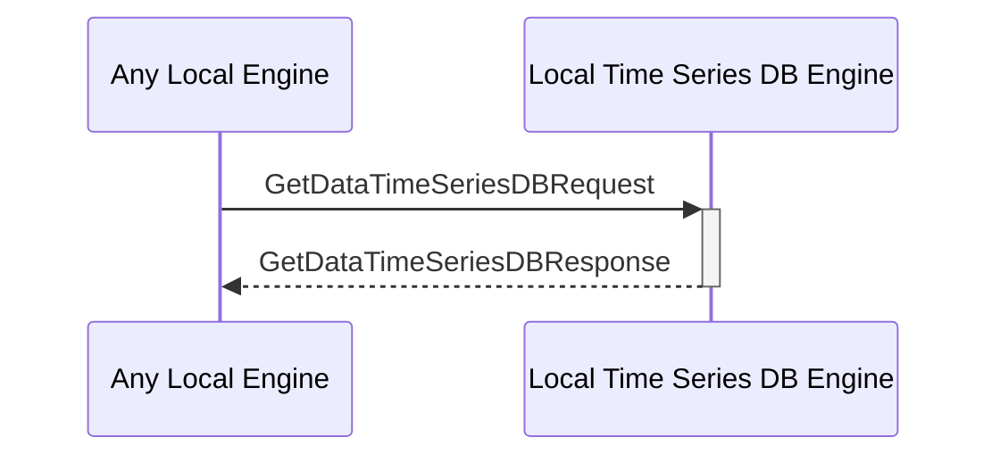

# GetDataTimeSeriesDBRequest

## Purpose

<!-- ANCHOR: purpose -->
Get the queried time series data and return it. 
<!-- ANCHOR_END: purpose -->

## Type

<!-- ANCHOR: type -->
**Reception:**

[[GetDataTimeSeriesDBRequestV1#getdatatimeseriesdbrequestv1]]

{{#include ../types/get-data-time-series-DB-request-v1.md:type}}

**Triggers**

[[GetDataTimeSeriesDBResponseV1#getdatatimeseriesdbresponsev1]]

{{#include ../types/get-data-time-series-DB-response-v1.md:type}}

<!-- ANCHOR_END: type -->

## Behavior

<!-- ANCHOR: behavior -->
Performs the requested search operation in the time series DB and returns the value.
<!-- ANCHOR_END: behavior -->

## Message Flow

<!-- ANCHOR: messages -->

<!-- ANCHOR_END: messages -->

