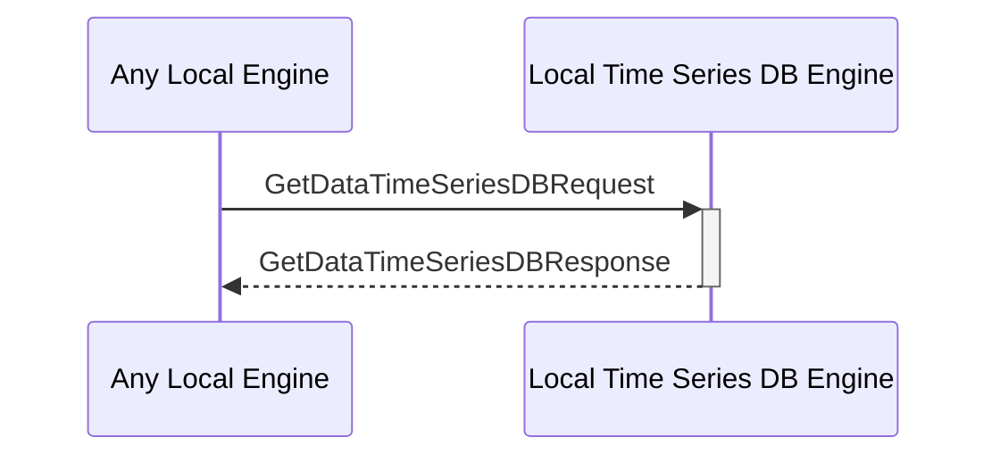

# GetDataTimeSeriesDBRequest

## Purpose

<!-- --8<-- [start:purpose] -->
Get the queried time series data and return it.
<!-- --8<-- [end:purpose] -->

## Type

<!-- --8<-- [start:type] -->
**Reception:**

[[GetDataTimeSeriesDBRequestV1#getdatatimeseriesdbrequestv1]]

--8<-- "../types/get-data-time-series-DB-request-v1.md:type"

**Triggers**

[[GetDataTimeSeriesDBResponseV1#getdatatimeseriesdbresponsev1]]

--8<-- "../types/get-data-time-series-DB-response-v1.md:type"

<!-- --8<-- [end:type] -->

## Behavior

<!-- --8<-- [start:behavior] -->
Performs the requested search operation in the time series DB and returns the value.
<!-- --8<-- [end:behavior] -->

## Message Flow

<!-- --8<-- [start:messages] -->

<!-- --8<-- [end:messages] -->

